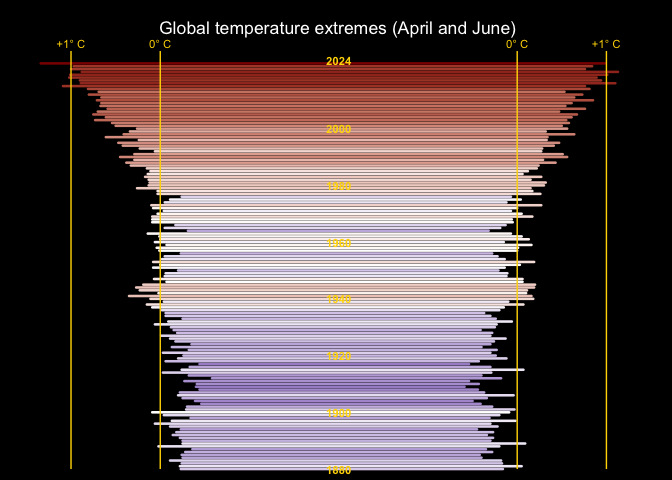
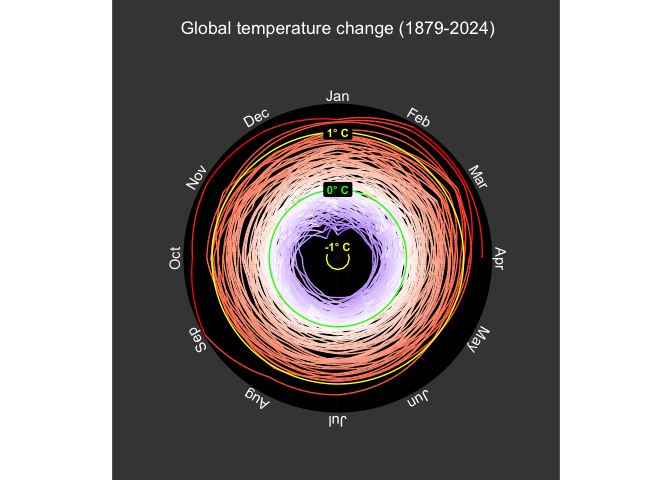

<!-- README.md is generated from README.Rmd. Please edit that file -->

# climateViz

<!-- badges: start -->

[](https://lifecycle.r-lib.org/articles/stages.html#experimental)
[](https://github.com/MathMarEcol/climateViz/actions/workflows/Ubuntu.yaml)
[](https://github.com/MathMarEcol/climateViz/actions/workflows/MacOS.yaml)
[](https://github.com/MathMarEcol/climateViz/actions/workflows/Windows.yaml)

<!-- badges: end -->

The goal of climateViz is to quickly and easily visualise the latest
climate data. By default the package uses the National Aeronautics and
Space Administration (NASA) Goddard Institute for Space Studies (GISS)
Surface Temperature Analysis (GISTEMP v4) Data. This package would not
be possible without the incredible work of Pat Schloss and
[Riffomonas](https://github.com/riffomonas).

## Installation

You can install the development version of climateViz from
[GitHub](https://github.com/) with:

``` r
# install.packages("remotes")
remotes::install_github("jaseeverett/climateViz")
```

## Example

``` r
library(climateViz)
```

``` r
climate_stripe()
```


``` r
climate_tornado()
#> Warning: Removed 1 row containing missing values or values outside the scale range
#> (`geom_segment()`).
```



``` r
climate_spiral()
```


